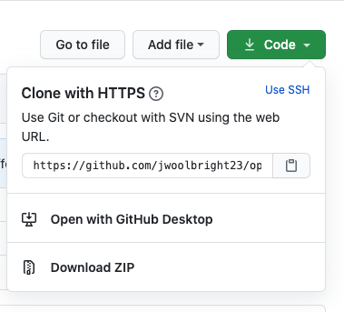

# open-source-starter-pack
Open source guide for beginners


# fork the repository (Nick)
Test One

# clone the repository (John)


The next step is to clone the repository to your machine. Navigate to your GitHub account, open the repository you forked, and click on the code button. You should now see a clipboard icon, clicking this copies the repository to your clipboard.

Navigate to your terminal and execute the following command:
```
git clone "url-you-just-copied"
```
Where "url-you-just-copied" (without using quotation marks) is the url to your forked repository. Refer to previous steps if you lose the url.

Example:
```
git clone https://github.com/your-github-account/open-source-starter-pack.git
```
Where "your-github-account" is your GitHub username. You are copying the contents of the open-source-starter-pack repository on GitHub to your machine.


# creating a new branch(Nick)

# making changes and commiting(John)
Now open Contributors.md with your preferred text editor so that you can add your name.

Example:
```
[firstName lastName](https://github.com/yourprofile)
```

Now you can navigate back to your project directory and run this git command `git status`, you should see that changes have been made to the Contributors.md file.

To add these changes to the branch you created run the git command `git add`:
```
git add Contributors.md
```
The last step is to commit these changes so that we can push them into our repository. You can do so by using the `git commit` command:
```
git commit -m "your custom message here"
```
# pushing changes(Nick)

# submitting changes for review and submit pull request(John)

# what next?(Both)
