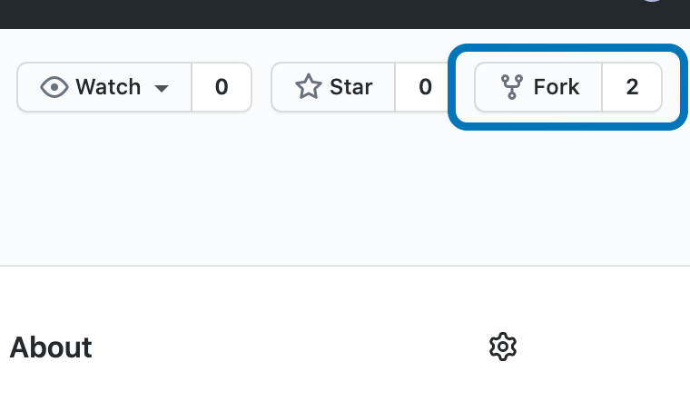
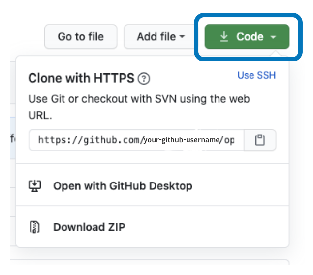
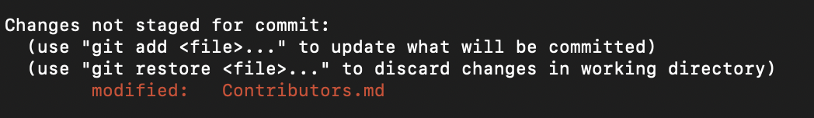
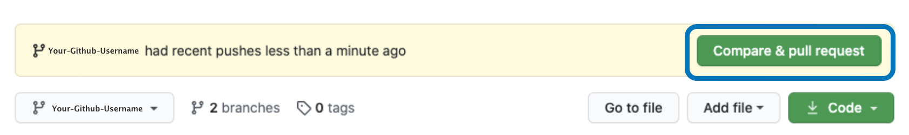
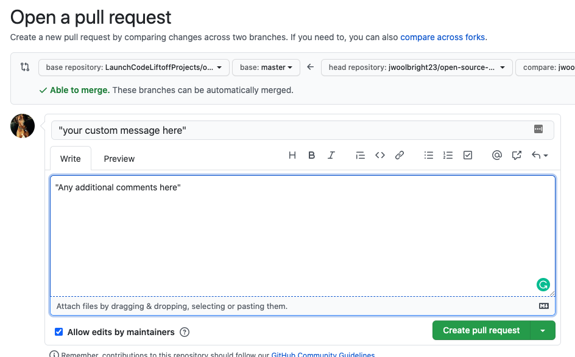

# LaunchCode's Open Source Starter Pack


### Welcome to your very first open source project!
If you hear the words open source, what emotions does it bring up for you? 

Fear? Intimidation? Intrigue? 

You know what's exciting, you're in the exact same boat as every LaunchCoder who has crushed this open source tutorial. You'll feel even better when you complete your very first open source project. So let's get started!

First, let's give you some context. Why are you here right now? Couple reasons:

<ol>
<li>Expand your skillset - Open source projects are a fantastic way to build your skills. You'll learn everything from git workflows to working with other people in an existing code base. User stories will become your best friend. 
</li>
<li> Showcase a more extensive portfolio to employers - Employers are always impressed by candidates who have worked on open source projects. Here is your chance to showcase your abilities.
<li> It's going to be fun - LaunchCoders always ask us what ways they can better get to know each other. Here is your chance. What better way to connect with another LaunchCoder than debugging a feature for countless hours with some fellow LaunchCoders. 
</li>
</li>
</ol>

### How should you use this guide? 

By following along to this readme and completing all the tasks, you are going to get your feet wet with your very first open source project. By the end of this project, you will have added your name to the list of contributors in the file Contributors.md. 

### Materials that might be useful as you go through this guide:
- If you don't have git downloaded on your computer, you can follow the instructions to [install git](https://docs.github.com/en/github/getting-started-with-github/set-up-git)
- If you want a more detailed guide on git workflow to follow along to, feel free to check out our [git guide](https://education.launchcode.org/liftoff/modules/git/git-workflow.html)

# Step 1: Fork the Repository

To get started, fork this repository. To do this, you'll click the "Fork" button in the top right corner. 

You're most likely already familiar with forking, but if not, forking is creating a copy of another repository. In this instance, you'll be creating a copy of this exact repository to your own personal GitHub account. That way you can make any edits you would like on your local computer, and then eventually submit those changes back to this repository. 

# Step 2: Clone the Repository


The next step is to clone the repository to your machine. Navigate to your GitHub account, open the repository you forked, and click on the code button. You should now see a clipboard icon, clicking this copies the repository to your clipboard.

Navigate to your terminal and execute the following command:
```
git clone "url-you-just-copied"
```
Where "url-you-just-copied" (without using quotation marks) is the url to your forked repository. Refer to previous steps if you lose the url.

Example:
```
git clone https://github.com/your-github-username/open-source-starter-pack.git
```
Where "your-github-username" is your GitHub username. You are copying the contents of the open-source-starter-pack repository on GitHub to your machine.


# Step 3: Creating a New Branch


Branching is an important concept when you're working on any project, but especially open source projects. You need to make sure you are creating a branch for each new feature you contribute to. For this example, you will create a branch to add your name to the Contributors.md file. 

Change to the repository you just cloned:
```
cd open-source-starter-pack
````

Now create a branch using the `git checkout` command:


*Note: You'll change nick-rafferty in the example below to your name when making your branch*
```
git checkout -b add-nick-rafferty
```

By making this branch, you now have made it clear to both yourself and others that the purpose of your branch is to add your name to the Contributors.md file. 


# Step 4: Making Changes and Submitting
Now open Contributors.md with your preferred text editor so that you can add your name.

Example:
```
[firstName lastName](https://github.com/yourprofile)
```

Now you can navigate back to your project directory and run this git command `git status`, you should see that changes have been made to the Contributors.md file.


To add these changes to the branch you created run the git command `git add`:
```
git add Contributors.md
```
The last step is to commit these changes so that we can push them into our repository. You can do so by using the `git commit` command:
```
git commit -m "your custom message here"
```
# Step 5: Pushing Those Changes


Push your changes to your GitHub repository using the command `git push`: 


```
git push origin <add-your-branch-name>
```

Now you might be a bit confused by this. Where is 'origin' coming from in the command above. You are currently working with 3 different repositories. That might seem confusing, but let's break it down. 
1. Your local repository - You've already created that and made changes starting with the git clone command. This is the local repository on your personal computer.
2. Your GitHub repository - This is referred to as origin. As soon as you forked the LaunchCode repository in step 1, you created a copy under your Github account. 
3. LaunchCodeLiftoffProjects/open-source-starter-pack - This was the original repository that you forked. 


So now that you've pushed to 'origin' or your Github repository, let's check it out and see the changes. Go to Github and check out the Contributors.md file. You should now see your name added to that file. 


# Step 6: Submitting Changes for Review and Submit Pull Request

The last step is going to be to make sure the changes you made are reflected back to the original repository LaunchCodeLiftoffProjects/open-source-starter-pack. 


Navigate to your GitHub repository and look for the `Compare & pull request` button.


Now submit your pull reqest:


After creating the pull request we will be able to merge these changes into the master branch of the open-source-starter-kit repository. Once the changes have been merged you will receive a notification.

# Step 7 and Beyond: Where to go from here?
We believe that a congratulations is in order! You have just completed what might be your first open-source workflow process. Contributing to open-source content will look and feel very similar to what you just experienced. 

Please feel free to share this with your friends and family to show them what you have accomplished.

Join us on Slack! - slackWorkSpaceHere

Now lets jump into some more open-source project work - openSourceProjectsHere
